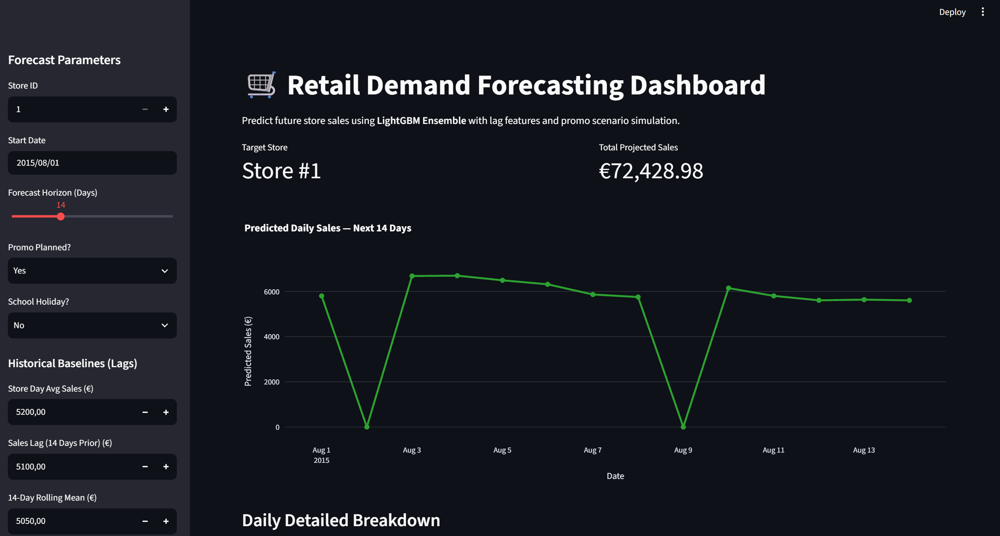
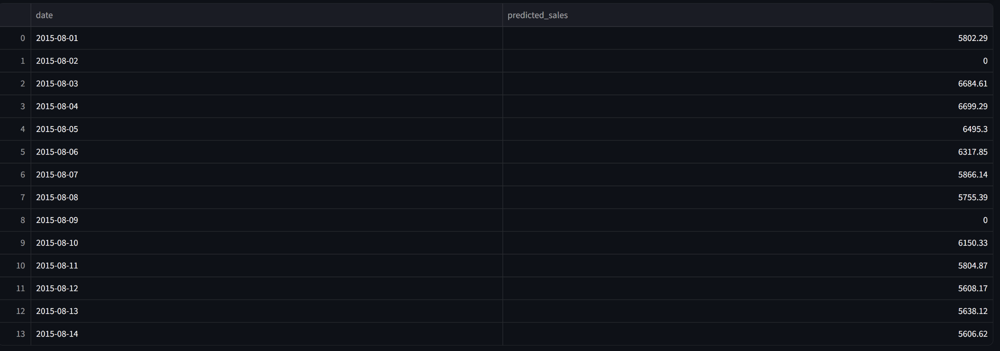

# 📈 Rossmann Store Sales — Production Demand Forecasting System

An end-to-end, production-ready retail demand forecasting system built on the Rossmann Store Sales dataset. The service leverages a **5-Fold TimeSeriesSplit LightGBM Ensemble**, automated time-series feature engineering, log-transformed target modeling, and a high-performance **FastAPI** backend fully containerized with **Docker & Docker Compose**.

---

## 🌟 Key Features

- **Advanced Feature Engineering**: Automatic generation of temporal lags (`sales_lag_14`, `30`), rolling statistics (`rolling_mean_14`, `rolling_std_14`), store-day target mean encoding (`store_day_avg_sales`), payday indicators (`IsPayday`), and trigonometric seasonality (`Sin_DayOfYear`, `Cos_DayOfYear`).
- **5-Fold Out-of-Fold (OOF) Ensemble**: Time-series cross-validation (`TimeSeriesSplit`) prevents future data leakage while averaging predictions across 5 LightGBM regressors to minimize variance.
- **Log Transformation**: Trained on $\log(1 + \text{Sales})$ to stabilize variance and directly optimize RMSPE.
- **RESTful FastAPI Service**:
  - `/predict`: Single-store demand forecasting.
  - `/predict-batch`: Vectorized batch prediction endpoint for multi-store inference.
  - **Business Rules Enforcement**: Automatic override to `0.0 EUR` for closed stores (`Open == 0`).
- **Production Containerization**: Fully dockerized environment with multi-stage builds and isolated networking.

---

## 📁 Repository Structure

```text
.
├── app/
│   ├── __init__.py
│   ├── feature_engineering.py   # Time-series feature pipeline
│   └── main.py                  # FastAPI REST API endpoints
├── data/
│   ├── train.csv                # Historical sales data
│   └── store.csv                # Store metadata
├── models/
│   └── lgbm_demand_model.pkl    # Trained 5-fold ensemble artifact
├── evaluation.ipynb             # Model validation & Plotly visualizations
├── train.py                     # Ensemble training pipeline
├── Dockerfile                   # Service container spec
├── docker-compose.yml           # Multi-container orchestration
└── requirements.txt             # Project dependencies
```
## 📊 Dashboards & Visualizations
Here is a preview of the interactive Streamlit dashboard and model evaluation outputs:



*Figure 1: Streamlit dashboard simulating scenario parameters and generating 14-day forecasts via the FastAPI backend.*



*Figure 2: Validation actual vs predicted sales curves and LightGBM ensemble feature importances.*